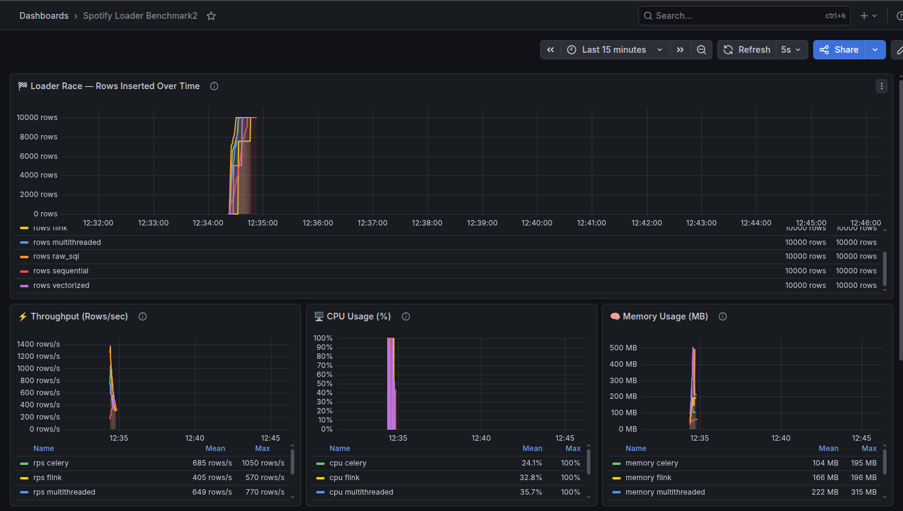
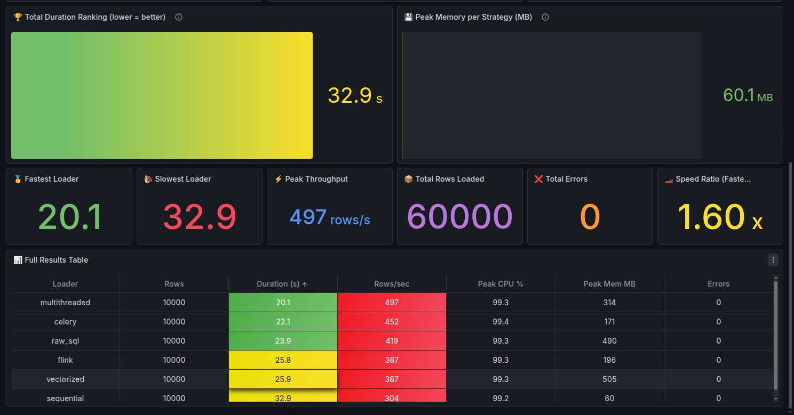

# Spotify Loader Benchmark

## Overview

This project provides a comprehensive benchmarking framework for evaluating different data loading strategies on Spotify dataset. It compares performance across various loading mechanisms including sequential, vectorized, multithreaded, raw SQL, Celery-based, and Flink-based loaders.

## Architecture

The benchmark consists of several components:

- **Airflow**: Orchestrates the benchmark workflow and data production
- **Kafka**: Message broker for data streaming
- **PostgreSQL**: Primary database for storing benchmark results and raw records
- **Cassandra**: Alternative storage option for high-throughput scenarios
- **Grafana**: Visualization dashboard for monitoring benchmark metrics
- **Loaders**: Six different loading implementations in Python

## Prerequisites

- Docker
- Docker Compose
- At least 8GB RAM recommended for running all services

## Setup

1. Clone this repository
2. Navigate to the project directory
3. Start all services:
   ```bash
   docker compose up -d
   ```

4. Wait for all containers to be healthy (check with `docker compose ps`)

## Usage

### Running the Benchmark

The benchmark can be triggered through the Airflow web UI or via command line.

1. Access Airflow at http://localhost:8080
2. Enable the `spotify_benchmark` DAG
3. Trigger the DAG manually or wait for scheduled execution

### Monitoring

- **Grafana Dashboard**: http://localhost:3000 (admin/admin)
- **Airflow UI**: http://localhost:8080
- **Logs**: Available in the `logs/` directory

#### Grafana Charts

Here are sample visualizations from the Grafana dashboard showing benchmark performance metrics:





## Testing

### Quick Test Commands

#### 1. Reset Database Tables
```bash
# Truncate tables to start fresh
docker exec spotify-loader-benchmark-postgres-1 \
  psql -U postgres -d benchmark -c "
  TRUNCATE raw_records;
  TRUNCATE loader_results;
  TRUNCATE bench_events;"
```

#### 2. Republish Fresh Data
```bash
# Generate and publish new dataset
docker compose exec airflow-webserver \
  env DATA_FILE=/opt/data/challenge_set.json KAFKA_BOOTSTRAP_SERVERS=kafka:29092 \
  python /opt/metrics/producer.py
```

#### 3. Run All Loaders Simultaneously
```bash
# Start all 6 loaders in parallel
for loader in sequential vectorized multithreaded raw_sql celery_loader flink_loader; do
  docker compose exec -d -e PYTHONPATH=/app celery-worker python /app/loaders/${loader}.py
  echo "Started $loader"
done
```
#### 4. Run Automatically with Airflow
```bash
docker compose exec airflow-webserver airflow dags trigger benchmark_dag
```

#### List Tasks
```bash
docker compose exec airflow-webserver airflow tasks list benchmark_dag
```

#### See Task States for a Run
```bash
docker compose exec airflow-webserver airflow tasks states-for-dag-run benchmark_dag manual__2026-04-26T10:34:04.868839+00:00
```

#### List DAG Runs
```bash
docker compose exec airflow-webserver airflow dags list-runs benchmark_dag
```


## Components

### Core Services
- `airflow/`: Apache Airflow orchestration with custom DAGs
- `flink/`: Apache Flink processing jobs
- `grafana/`: Monitoring dashboards
- `init/`: Database initialization scripts
- `metrics/`: Data producer and common utilities

### Loaders
Located in `loaders/` directory:
- `sequential.py`: Single-threaded sequential loading
- `vectorized.py`: Vectorized operations for bulk inserts
- `multithreaded.py`: Multi-threaded loading approach
- `raw_sql.py`: Direct SQL execution without ORM
- `celery_loader.py`: Distributed loading using Celery
- `flink_loader.py`: Stream processing with Apache Flink

### Data
- `data/challenge_set.json`: Sample Spotify dataset for benchmarking

## Configuration

Key configuration files:
- `docker-compose.yaml`: Service definitions and networking
- `airflow/config/`: Airflow configuration
- `grafana/provisioning/`: Dashboard and datasource configs

## Development

### Adding New Loaders

1. Create a new Python file in `loaders/`
2. Implement the loading logic
3. Update the benchmark DAG to include the new loader
4. Add monitoring metrics if needed

### Customizing Dataset

Replace `data/challenge_set.json` with your own dataset following the same JSON structure.

## Troubleshooting

### Common Issues

- **Container startup failures**: Ensure sufficient RAM and check logs with `docker compose logs <service>`
- **Kafka connection issues**: Verify network connectivity between services
- **Database connection errors**: Check PostgreSQL/Cassandra health

### Logs

All service logs are available via:
```bash
docker compose logs <service-name>
```

## Contributing

1. Fork the repository
2. Create a feature branch
3. Make your changes
4. Add tests if applicable
5. Submit a pull request

## License

This project is licensed under the MIT License.